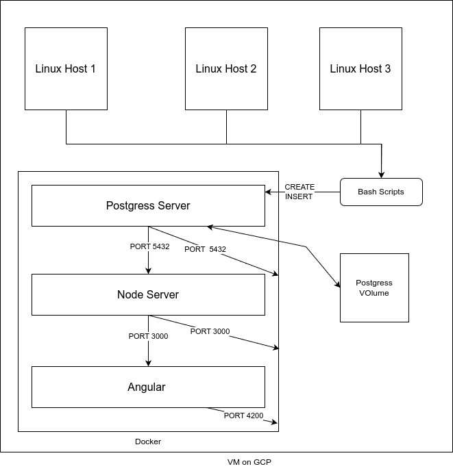

# Introduction
 The objective is to facilitate the real-time tracking of memory changes per minute on a machine, streamlining the process of monitoring system usage without the hassle of navigating through extensive log files. The VM(Virtual machine) instance is initialized on GCP(Google Cloud Platform) with essential configurations through a startup script.

For efficient application deployment, Docker is employed. It efficiently manages and runs the PostgreSQL server, Node.js server, and Angular.js on the VM instance. A DLL script is utilized to initialize tables, while a bash script parses data from tools like vmsat and lscpu to be inserted into the database. To ensure data insertion at regular intervals, crontab is configured to run the bash script every minute.

To provide accessible data to developers, a GET API is crafted, allowing Angular.js to present a visual representation of the inserted data. Simplifying the container creation and establishing network communication among them is achieved through the utilization of Docker Compose. This project amalgamates several technologies to streamline data tracking and visualization for enhanced system management.

# Quick Start
To quickly set up and start using this project, follow the steps outlined below using the provided scripts and configurations:

```bash
# Start a PostgreSQL (psql) instance using psql_docker.sh
./scripts/psql_docker.sh

# Create tables using ddl.sql
psql -h localhost -U <your_username> -d host_agent -a -f ./sql/ddl.sql

# Insert hardware specs data into the database using host_info.sh
./scripts/host_info.sh localhost 5432 host_agent <your_username> <your_password>

# Insert hardware usage data into the database using host_usage.sh
./scripts/host_usage.sh localhost 5432 host_agent <your_username> <your_password>

# Set up crontab for regular data insertion
* * * * * /path/to/host_usage.sh localhost 5432 host_agent <your_username> <your_password>
```

Additionally, to orchestrate the containers and streamline the deployment process, Docker Compose is utilized. Ensure you have Docker Compose installed and images created from node_app and angular _app then execute the following command in the project directory:

```bash
docker-compose up
```

These commands will initialize a PostgreSQL instance, NodeJS server, and Angular Server while exposing the necessary ports for communication outside the Docker network. Essentially, it orchestrates containers with Docker Compose for a seamless deployment experience. Adjust parameters as needed for your environment.


# Implementation
## Architecture
The project's architecture revolves around deploying a virtual machine (VM) on Google Cloud Platform (GCP) for real-time system monitoring. Docker is utilized to manage and run key components like PostgreSQL, Node.js, and Angular on the VM instance. The entire setup is orchestrated using Docker Compose for efficient container management.



## Scripts

1. **psql_docker.sh:** Initializes a PostgreSQL instance within a Docker container.
   ```bash
   ./psql_docker.sh
   ```
2. **ddl.sql:** Defines and initializes tables for the database.
3. **host_info.sh:** Parses hardware specs data from tools like vmsat and lscpu, inserting it into the database.
   ```bash
   ./host_info.sh
   ```
4. **host_usage.sh:** Extracts hardware usage data at regular intervals using crontab, ensuring data insertion every minute.
   ```bash
   ./host_usage.sh
   ```
5. **crontab:** Configures crontab to execute `host_usage.sh` at regular intervals for consistent data insertion.
6. **Docker-compose.yml:** YML file that helps define and share multi-container applications which let you splin every thing up or stop using a single command.

## Database Modeling
### host_info Table
```markdown
| Field           | Type    | Constraints                        |
|-----------------|---------|------------------------------------|
| id              | SERIAL  | PRIMARY KEY                        |
| hostname        | VARCHAR | NOT NULL, UNIQUE                   |
| cpu_number      | INT2    | NOT NULL                           |
| cpu_architecture| VARCHAR | NOT NULL                           |
| cpu_model       | VARCHAR | NOT NULL                           |
| cpu_mhz         | FLOAT8  | NOT NULL                           |
| l2_cache        | INT4    | NOT NULL                           |
| timestamp       | TIMESTAMP | NULL                             |
| total_mem       | INT4    | NULL                               |
```

### host_usage Table
```markdown
| Field           | Type      | Constraints                        |
|-----------------|-----------|------------------------------------|
| timestamp       | TIMESTAMP | NOT NULL                           |
| host_id         | SERIAL    | NOT NULL, FOREIGN KEY (host_id) REFERENCES host_info(id) |
| memory_free     | INT4      | NOT NULL                           |
| cpu_idle        | INT2      | NOT NULL                           |
| cpu_kernel      | INT2      | NOT NULL                           |
| disk_io         | INT4      | NOT NULL                           |
| disk_available  | INT4      | NOT NULL                           |
```

This ensures a structured database schema to handle hardware information and usage statistics.

## Test
The bash scripts (`host_info.sh`, `host_usage.sh`, `psql_docker.sh`) were thoroughly tested to validate their functionality in initializing the PostgreSQL instance, creating tables, and consistently inserting data into the database.
The Docker Compose configuration is tested to automatically recognize an existing mounted volume; if one does not exist, it will create a new volume. This approach ensures that data is stored persistently on the local machine, outside of the container environment.

## Deployment
The deployment involves executing the provided scripts, such as `psql_docker.sh` for PostgreSQL initiation, `ddl.sql` for table creation, and `host_info.sh` and `host_usage.sh` for data insertion. Docker Compose orchestrates these components, streamlining the deployment process. Adjustments can be made to script parameters based on the environment.

## Improvements
1. **Enhanced Hardware Updates:** Incorporate mechanisms to handle real-time hardware updates.
2. **Optimized Docker Orchestration:** Fine-tune Docker Compose configurations for improved container orchestration.
3. **Expanded Data Visualization:** Extend the Angular app to provide more comprehensive insights into system metrics.
